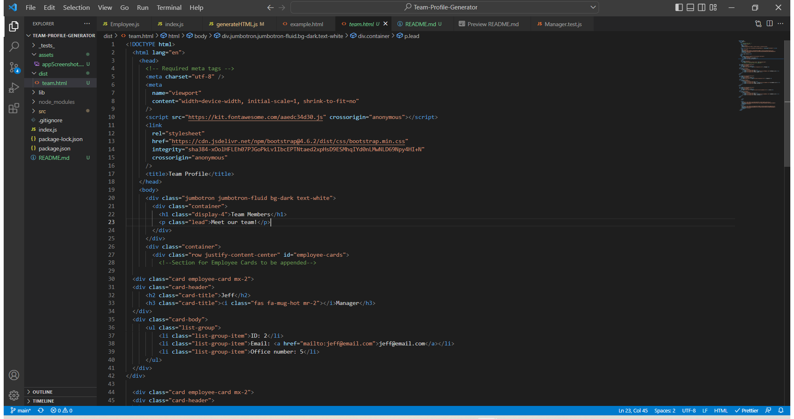

# Team Profile Generator

## Description

A command line application that generates a web page through users input.

## Table of Contents

- [Installation](#installation)
- [Usage](#usage)
- [Credits](#credits)
- [Contributing](#contributing)
- [Questions](#questions)
- [Tests](#tests)

## Installation

npm i

## Usage

Used to generate a team home page with descriptors of the employees.

Video [Walkthrough](https://drive.google.com/file/d/1pvPUEjATH9fWhVduLa77IkLiolYoGNlK/view)

## Contributing

Contact me via email.

## Questions

Please contact me via the following methods.

- Github: [JCaloca](https://github.com/JCaloca)
- Email:

## Tests

npm test
